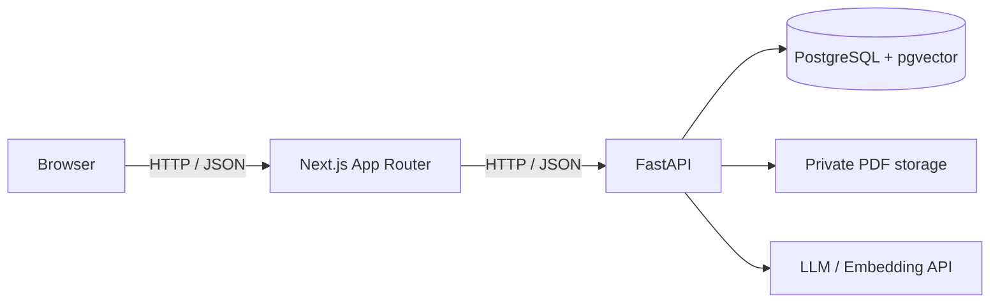

# AI Tutor

教材を根拠に質問へ答えるだけでなく、**レッスン、演習、採点、習熟度更新までを一つの学習体験としてつなぐ**AIチューターの技術検証です。

7日間で動く縦切りを完成させることを目標に、対象を線形代数の1概念（`la.linear_combination` / 線形結合）へ限定しています。機能を広く浅く作るのではなく、教材登録から学習履歴の保存までを一貫したデータモデルで実装することを重視しています。

> **現在のステータス:** 開発中。Next.js / FastAPI / PostgreSQL + pgvectorの基盤と、SQLAlchemy / AlembicによるDB接続・migrationまで実装済みです。学習コンテンツ、採点・Mastery、RAGは今後の実装範囲です。

## 解決したい課題

一般的なRAGチャットは教材への質問には答えられても、「何を学び、どこまで理解し、次に何をすべきか」という学習状態を扱いません。本プロジェクトでは、次の流れを一つの画面とデータモデルで接続します。

```text
教材PDFの登録 → チャンク・Embedding生成 → レッスン表示
→ 教材根拠付きAI質問 → 問題・段階的ヒント → 採点
→ Mastery更新 → 学習履歴の保存
```

## プロジェクトの特徴

- **教材根拠を追跡できる回答**: 回答に教材名とページ番号を付け、関連する根拠が見つからない場合は回答生成を抑止します。
- **LLMに依存しない評価**: 採点とMastery更新は決定的なロジックで行い、同じ入力から同じ結果を再現できる設計です。
- **学習単位を中心にした設計**: 教材や会話ではなくKnowledge Component（KC）を中心に、レッスン、問題、履歴、習熟度を関連付けます。
- **小さくても端から端まで動く構成**: 対象を1KC・単一ユーザーに絞り、フロントエンド、API、DB、AI連携を縦に通します。
- **安全性を境界で担保**: APIキーをサーバー側だけで扱い、PDFは公開領域外へ保存し、LLMへ渡す教材チャンクを最小限にします。

## 現在の実装状況

| 領域 | 状態 | 内容 |
|---|---|---|
| Frontend | 実装済み | Next.js App Router、学習ルート、FastAPI接続状態の表示、loading / error UI |
| Backend | 実装済み | FastAPI、アプリ・DBヘルスチェック、環境変数による設定 |
| Database | 実装済み | PostgreSQL 17 + pgvector、SQLAlchemy Session、Alembic基準migration |
| KC / Lesson | 一部実装 | KC YAMLは作成済み。DBモデル、レッスン、登録APIは未実装 |
| Assessment | 未実装（設計済み） | 決定的な採点、段階的ヒント、Attempt保存、Mastery更新 |
| RAG Tutor | 未実装（設計済み） | PDF登録、Embedding、類似検索、出典付き回答、根拠不足時の抑止 |

詳細な進捗は[7日版ToDo](docs/mvp-todo.md)で管理しています。

## 技術スタック

| レイヤー | 技術 |
|---|---|
| Frontend | Next.js 16, React 19, TypeScript, Vitest |
| Backend | FastAPI, Python 3.12+, pytest, Ruff |
| Database | PostgreSQL 17, pgvector |
| ORM / Migration | SQLAlchemy 2, Alembic |
| Infrastructure | Docker Compose |
| LLM / Embedding | バックエンドの環境変数でモデルを指定予定 |

## アーキテクチャ



設計上、次の責務を分離します。

- Next.jsは表示とユーザー操作を担当し、秘密情報を保持しません。
- FastAPIは入力検証、教材処理、検索、採点、Mastery更新を担当します。
- PostgreSQLはKC、問題、教材チャンク、回答履歴、Masteryを一貫して保存します。
- 採点結果とMasteryは同一トランザクションで更新し、片方だけが残る状態を防ぎます。

より詳しいデータモデルと処理フローは[Architecture](docs/architecture.md)を参照してください。

## 技術選定と設計判断

### Next.js App Router + FastAPI

初期データ取得はServer Component、回答・ヒント・AI質問などの操作はClient Componentへ分離する方針です。AI・教材処理をPython側へ集約することで、ブラウザへAPIキーを露出させず、データ処理ライブラリも利用しやすくしています。

### PostgreSQL + pgvector

学習データとベクトルを同じDBで扱い、1KC規模の検証で不要な分散構成を避けています。KCによる絞り込みとベクトル類似検索を組み合わせ、回答根拠を元の教材ページまで追跡できる形で保存します。

### 決定的な採点とMastery

LLMは教材に基づく説明に利用し、正誤判定や習熟度の更新には利用しません。評価ロジックをテスト可能にし、回答ごとの根拠、更新前後の値、計算方式の版を履歴へ残す設計です。

## ローカルセットアップ

### 前提環境

- Node.js 20+
- Python 3.12+
- [uv](https://docs.astral.sh/uv/)
- Docker Desktop（Docker Composeを含む）

### 1. 環境変数

```console
cp .env.example .env
cp apps/frontend/.env.example apps/frontend/.env.local
```

`.env`の初期値はローカル開発用です。APIキーは今後LLMプロバイダーを接続する際に追加し、Gitには含めません。

### 2. PostgreSQL + pgvector

```console
docker compose up -d db
docker compose ps
```

`db`が`healthy`になったら、migrationを適用します。

```console
cd apps/backend
uv sync

uv run alembic upgrade head
uv run alembic current

uv run alembic downgrade -1
uv run alembic current

uv run alembic upgrade head
uv run alembic current
```

pgvector拡張は次のコマンドで確認できます。

```console
docker compose exec -T db psql -U ai_tutor -d ai_tutor \
  -c "SELECT extname, extversion FROM pg_extension WHERE extname = 'vector';"
```

### 3. FastAPI

`apps/backend`で起動します。

```console
uv run uvicorn app.main:app --reload --port 8000
```

以下のレスポンスが返れば起動完了です。

```console
curl --fail http://127.0.0.1:8000/health
# {"status":"ok"}

curl --fail http://127.0.0.1:8000/health/database
# {"status":"ok"}
```

### 4. Next.js

別のターミナルで起動します。

```console
cd apps/frontend
npm ci
npm run dev
```

[http://localhost:3000](http://localhost:3000)を開き、学習ページでFastAPIが「接続済み」と表示されることを確認します。

## テストと品質チェック

Backend:

```console
cd apps/backend
uv run python -m pytest
uv run ruff check .
```

Frontend:

```console
cd apps/frontend
npm test
npm run lint
npm run build
```

現時点ではBackend 6件、Frontend 11件のテストを用意しています。ヘルスチェック、設定、DB Session、migration、APIレスポンス変換を対象にしています。

## ディレクトリ構成

```text
apps/
├── frontend/          # Next.js App Router
└── backend/           # FastAPI / SQLAlchemy / Alembic
data/
├── kcs/               # レビュー済みKCデータ
└── books/             # 教材PDF（Git管理外）
docker/postgres/init/  # pgvector初期化
docs/                  # 要件、設計、計画、Mastery方針
scripts/               # 教材・KCの生成、検証、登録
tests/fixtures/pdfs/   # CC0サンプル教材
```

## スコープ

このリポジトリは完成した製品版MVPではなく、**線形結合1KCの学習フローを検証する開発中のプロトタイプ**です。

### 7日版で実装するもの

- 線形結合のレッスン、2問の演習、3段階以上のヒント
- 決定的な採点、回答履歴、簡易Mastery Score
- CC0 PDFの登録、ページ単位の抽出、Embedding、類似検索
- 教材名・ページ番号を示すAI回答と、根拠不足時の回答抑止
- 主要フローのテストと再現可能なローカル実行手順

### 対象外

- 複数ユーザー、認証、課金、クラウド公開
- OCR、マルチモーダル解析、高度なRAG、汎用PDF対応
- Socratic Mode、Explain-back評価、Python演習、本格的な復習機能
- 本番運用水準のセキュリティ、性能、可用性

## ドキュメント

- [要件定義](docs/requirements.md)
- [Architecture](docs/architecture.md)
- [7日版ToDo](docs/mvp-todo.md)
- [Issue一覧・依存関係](docs/backlog-candidates.md)
- [Mastery Policy](docs/mastery-policy.md)

## License

ライセンスは未設定です。
