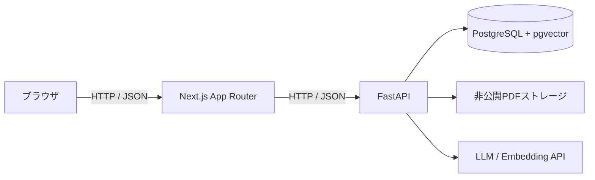
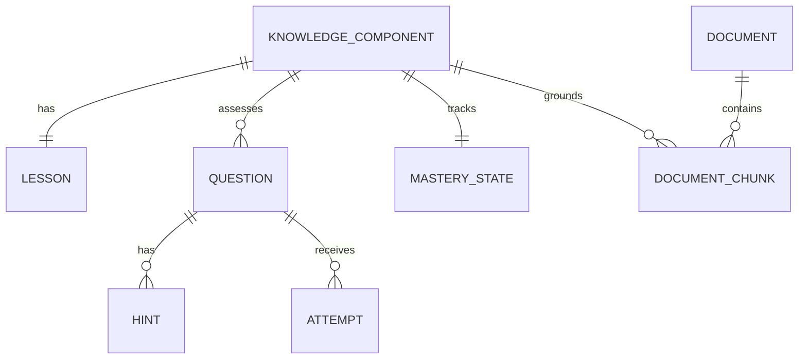

# AI Tutor 7日版 Architecture

## 1. 設計原則

- 学習管理の中心は教材や章ではなく`la.linear_combination`というKCとする。
- 採点とMastery更新はプログラムで決定し、LLMに決定させない。
- AI回答は参照チャンクまで追跡でき、根拠不足時は回答を抑止する。
- 7日で必要な境界だけを分離し、未使用の汎用化は行わない。
- モデル名と閾値は設定可能にし、回答履歴には計算版を残す。

## 2. システム構成



### Next.js

- `app/learn/[kcId]/page.tsx`が学習画面の入口。
- 初期データはServer Componentで取得する。
- 回答、ヒント、AI質問などの操作だけClient Componentへ分離する。
- 公開可能な設定だけ`NEXT_PUBLIC_`を使用する。

### FastAPI

- API層: 入出力検証とHTTPエラーへの変換。
- Service層: 教材処理、検索、AI回答、採点、Mastery更新。
- Repository層: SQLAlchemyによる永続化。
- Settings層: DB、モデル、閾値、アップロード上限を環境変数から読む。

### PostgreSQL + pgvector

- KC、レッスン、問題、ヒント、教材、チャンク、Attempt、Masteryを保存する。
- チャンクEmbeddingをvector列へ保存し、類似検索に使う。
- Alembicでスキーマ変更を再現する。

## 3. 最小データモデル



主な責務:

- `KnowledgeComponent`: KC ID、説明、学習目標、前提KC。
- `Lesson`: 説明、具体例、確認問題の表示内容。
- `Question` / `Hint`: 正答、採点方式、順序付きヒント。
- `Attempt`: 回答、評価、最大ヒント、evidence、更新前後のMastery、時刻。
- `MasteryState`: 現在値、状態、計算方式の版。
- `Document`: 元ファイル情報、保存先、サイズ、チェックサム。
- `DocumentChunk`: 本文、ページ、KC、Embedding、モデル名。

7日版は単一ユーザーのため`user_id`と認証モデルを持たない。

## 4. 主要フロー

### 教材登録

```text
PDF検証 → 非公開保存 → チェックサム記録 → ページ抽出
→ チャンク作成 → Embedding生成 → pgvector保存
```

### AI質問

```text
質問検証 → 質問Embedding → KCで絞った類似検索
→ 関連度判定
├─ 不足: 根拠不足を返す
└─ 十分: 最小チャンクでLLM回答 → 構造化出力検証 → 出典返却
```

### 回答とMastery

```text
回答送信 → 決定的な採点 → evidence計算 → Mastery更新
→ AttemptとMasteryStateを同一トランザクションで保存 → 結果返却
```

## 5. API境界（予定）

| Method | Path | 用途 |
|---|---|---|
| `GET` | `/health` | 稼働確認 |
| `GET` | `/api/kcs/{kc_id}` | KC・レッスン・問題取得 |
| `POST` | `/api/questions/{question_id}/attempts` | 採点、履歴、Mastery更新 |
| `GET` | `/api/kcs/{kc_id}/mastery` | Mastery取得 |
| `POST` | `/api/documents` | PDF登録とインデックス作成 |
| `POST` | `/api/tutor/questions` | 根拠付きAI回答 |

実装時にパスは調整できるが、責務を混在させない。

## 6. 安全性と失敗時の方針

- PDFはNext.jsの`public`配下へ置かない。
- MIME、拡張子、サイズを確認し、保存名をサーバー側で生成する。
- APIキーとプロンプト全文をログへ出さない。
- 教材チャンクをデータとして扱い、そこに含まれる命令へ従わない。
- LLMの出力は未検証のまま保存・表示しない。
- DB更新失敗時にAttemptだけ、またはMasteryだけが残らないようにする。

## 7. 意図的な簡略化

対象KC、教材、レッスンは各1つ。検索はベクトル類似度とKC絞り込みだけ、
採点は固定回答または数値問題だけとする。会話履歴、復習スケジュール、
PDFビューアー、複数プロバイダー抽象化は追加しない。
