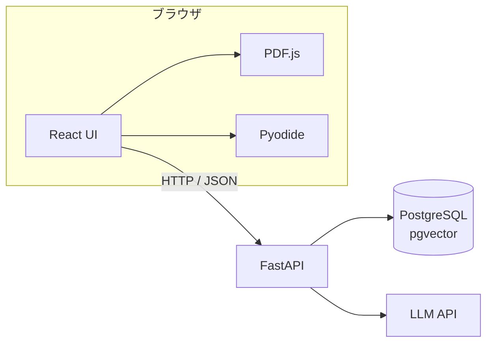
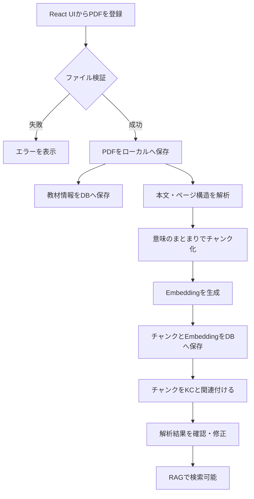
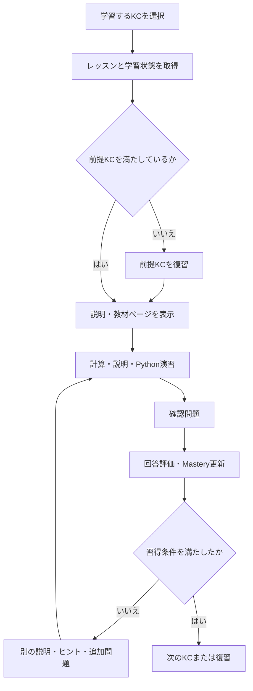
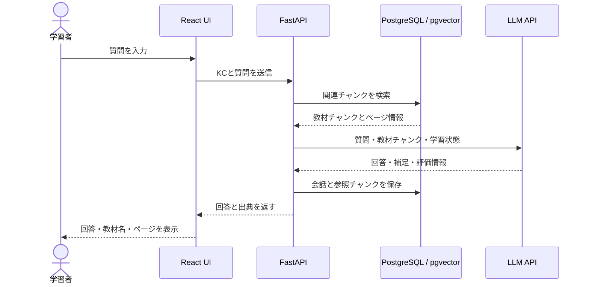
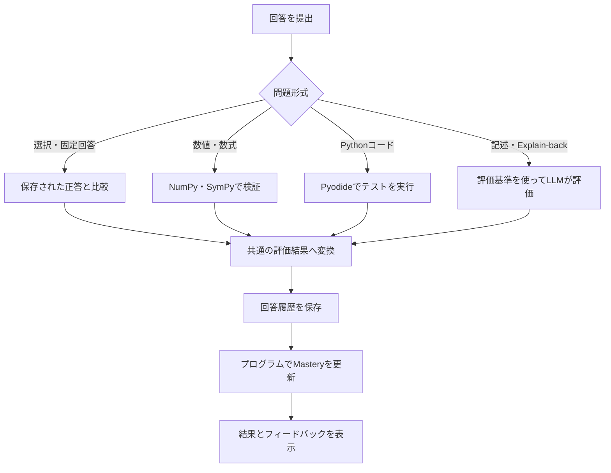
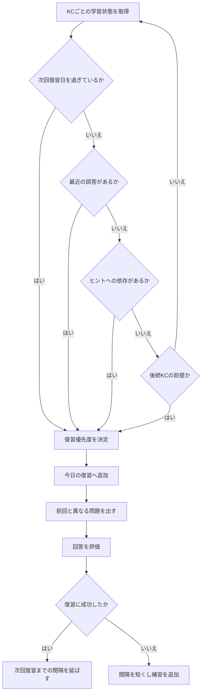

# AI Tutor Architecture

## 1. 文書の目的と対象範囲
本書は、AIチューターのMVPにおけるシステム全体構成、主要な責務、
データの関係および処理フローを示す。

各APIの仕様、データベースの全カラム、Masteryの具体的な計算式などの
実装詳細は本書の対象外とし、実装または個別の設計文書で管理する。

## 2. 設計原則
### 2.1 KCを学習管理の中心とする
方針：
教材の章やPDFを学習の中心単位とせず、Knowledge Component（KC）を
レッスン、問題、教材、習熟度、復習の共通単位とする。

理由：
同じ概念が複数の教材に登場するため、教材ごとに学習状態を管理すると、
学習者が概念を理解しているかを一貫して追跡できない。
また、本システムでは教科書の読了ではなく、知識の習得を目的としている。

設計への影響：
- 教材チャンク、問題、レッスン、学習履歴をKCに関連付ける。
- 学習順序は章番号ではなく、KC間の前提関係から決定する。
- Mastery Scoreと復習予定はKC単位で保持する。
- 複数教材の同一概念を、同じKCから参照できるようにする。

トレードオフ：
KCの粒度や前提関係を事前に設計する必要があり、教材を章単位で扱う場合より
初期データ作成の負担が大きくなる。


### 2.2 検証可能性に応じてLLMとプログラムの責務を分ける
機械的に検証できる正誤判定とMastery更新はプログラムで行い、
説明生成や記述評価にはLLMを利用する。これにより、LLMの柔軟性を
利用しながら、学習状態の更新に再現性を持たせる。
### 2.3 AIの回答根拠を追跡可能にする

AIの回答には参照した教材とページを関連付ける。教材に基づく説明と
AIによる補足を区別し、根拠が不足する場合はそのことを明示する。
### 2.4 学習状態をKC単位で管理する
正答状況、誤りの種類、ヒント使用量を回答履歴として保存し、
KCごとのMasteryを更新する。Masteryの値だけでなく、更新根拠を
追跡できるようにする。

### 2.5 MVPを優先し、必要な箇所だけ交換可能にする
MVPでは簡易Mastery Scoreなど、理解しやすく変更しやすい方式を採用する。
回答履歴などの元データを保持し、必要性が確認できた場合に計算方式、
LLM、Embeddingモデルおよび検索方式を変更できるようにする。

一方、変更の可能性が明確でない部分は過度に抽象化しない。

## 3. システム全体構成

### 3.1 構成図


### 3.2 各コンポーネントの責務
#### React UI
役割：

学習者へレッスン、問題、教材、学習状況を表示し、ユーザー操作を
受け付けるWebフロントエンドである。

主な責務：

- KC、レッスン、問題、Masteryを画面に表示する。
- ユーザーの回答、質問、ヒント要求を受け付ける。
- FastAPIを呼び出し、取得したデータを表示する。
- PDF.jsを利用して教材ページを表示する。
- Pyodideを利用してPython演習を実行する。
- 画面表示に必要な一時的な状態を管理する。

担当しないこと：

- Masteryの計算や学習順序の決定は行わない。
- RAG検索やLLMの呼び出しは行わない。
- PostgreSQLへ直接アクセスしない。
- APIキーなどの秘密情報を保持しない。


#### PDF.js
役割：
教材PDFをブラウザ上に表示し、学習者が解答の根拠となるページを確認できるようにする。

主な責務：
- 教材PDFの指定されたページを表示する。
- ページ移動、拡大、縮小などの閲覧操作を提供する。

担当しないこと：
- PDFからRAG用チャンクを作成しない。
- OCRや数式認識などの教材解析を行わない。
- PDFファイルや学習履歴を保存しない。

#### Pyodide
役割：
学習者が入力したPythonコードをブラウザ内で実行し、その結果を学習画面へ返す。

主な責務：
- 学習者が入力したPythonコードを実行する。
- NumPy、SymPy、Matplotlibなど、演習に必要なパッケージを読み込む。
- 標準出力、計算結果、グラフ、実行エラーをReact UIへ返す。
- 演習用のテストコードを実行する。
- Python実行によって画面が停止しないよう、Web Worker上で動作する。

担当しないこと：
- Python演習の問題文やヒントを生成しない。
- Masteryを更新しない。
- 学習履歴を保存しない。
- PostgreSQLやLLM APIへ直接アクセスしない。


#### FastAPI
役割：
フロントエンドへAPIを提供し、学習処理、RAG、Mastery更新、データ保存を統括する。

主な責務：

- React UIから受け取ったリクエストを検証する。
- KC、レッスン、問題、学習履歴を取得して返す。
- 教材検索とLLM呼び出しを組み合わせ、回答を生成する。
- 問題の回答結果からMasteryを更新する。
- PostgreSQLへのデータ保存と取得を行う。
- LLM APIキーなどの秘密情報を管理する。
- PDF登録と教材解析の処理を開始する。

担当しないこと：
- 学習画面を表示しない。
- ブラウザ内のPython演習を実行しない。
- LLMが担当する自然言語の生成を独自に行わない。
- データをメモリだけで永続的に保持しない。

#### PostgreSQL/pgvector
役割：
教材、KC、レッスン、回答履歴、Masteryなどの永続データと、RAG検索に使用するEmbeddingを保存する。

主な責務：
- KC、レッスン、問題のデータを保存する。
- 回答履歴とMasteryを保存する。
- 教材のメタデータと抽出されたチャンクを保存する。
- pgvectorを使用してEmbeddingを保存し、類似検索を行う。
- データ間の関連と整合性を維持する。

担当しないこと：

- 教材の説明やヒントを生成しない。
- Masteryの計算方法を決定しない。
- PDFの解析やEmbeddingの生成を行わない。
- React UIやLLM APIから直接アクセスされない。

#### LLM API
役割：
FastAPIから渡された教材の根拠、学習状況、指示に基づいて、説明、問題、ヒント、記述評価を生成する。

主な責務：
- 教材に基づく説明を生成する。
- 学習者の理解状況に応じたヒントを生成する。
- 練習問題の候補を生成する。
- 評価基準に基づいて記述回答を評価する。
- FastAPIが処理できる構造化された形式で結果を返す。

担当しないこと：
- PostgreSQLや教材PDFへ直接アクセスしない。
- 使用する教材チャンクを自分で検索しない。
- Masteryや学習状態を直接更新しない。
- 数値問題やコード問題の正しさを最終決定しない。
- 生成した内容の永続保存を行わない。


## 4. 主要ドメインとデータ

本章では、システムが扱う主要な概念と、それらの関係を示す。
具体的なテーブル名、全カラム、型、インデックスは実装時に定義する。

### 4.1 Knowledge Component

Knowledge Component（KC）は、学習者が習得すべき知識や技能を、評価可能な粒度に分割したものである。

教材の章ではなくKCを学習管理の中心とし、レッスン、問題、教材箇所、回答履歴、MasteryをKCへ関連付ける。

KCは主に次の情報を持つ。

- ID
- 名称
- 説明
- 学習目標
- 重要度
- 習得基準
- 前提となるKC
- 後続するKC

KC同士は前提関係を持つ。

例：

線形結合を学ぶには、ベクトル加算とスカラー倍の理解が必要である。
行列ベクトル積を学ぶには、線形結合の理解が必要である。

前提関係は、学習順序の決定と、理解不足時に復習するKCの選択に利用する。

### 4.2 教材とチャンク

教材は、学習内容の根拠として登録するPDFおよびそのメタデータを表す。

教材は主に次の情報を持つ。

- 教材名
- 著者
- 版
- 言語
- PDFファイルの保存場所
- ライセンスと利用範囲

PDF本体は、MVPではFastAPIが管理するローカルの専用ディレクトリへ保存する。
PostgreSQLには、元のファイル名、保存先、ファイルサイズ、チェックサムなどの
メタデータを保存する。

React UIはローカルファイルへ直接アクセスせず、FastAPIが提供するAPIを
通してPDFを取得する。

将来クラウド環境へ移行する場合は、ローカルファイル保存をオブジェクト
ストレージへ交換できるようにする。

教材チャンクは、RAGで検索するために教材を意味のまとまりごとに分割したデータである。固定文字数だけで分割せず、章、節、段落、定義、例題、数式、図とその説明などの構造を考慮する。

教材チャンクは主に次の情報を持つ。

- 所属する教材
- 本文または解析結果
- 開始ページと終了ページ
- 章と節
- 定義、説明、例題などの内容種別
- Embedding
- 解析に関するメタデータ

一つの教材チャンクが複数のKCと関係する場合があり、一つのKCも複数教材のチャンクを参照できる。

KCと教材チャンクの関連には、次のような関係種別を持たせる。

- 定義
- 説明
- 具体例
- 応用
- 演習
- 補足

これにより、AIは現在のKCと質問内容に応じて、適切な教材箇所を検索できる。

### 4.3 レッスンと問題

レッスンは、一つのKCを学習するために、教材の内容を学習活動として構成したものである。教材の章をそのままレッスンにはせず、KCの学習目標を達成するために必要な説明、例題、演習をまとめる。

レッスンは主に次の情報を持つ。

- 対象KC
- タイトル
- 学習目標
- 要約
- 参照する教材チャンク
- 学習活動
- 公開・作成状態

MVPでは一つのKCに一つの基本レッスンを作成する。将来、同じKCに対して難易度や説明方法の異なる複数レッスンを持てるようにする。

問題は、KCの理解状態を確認するための評価単位である。

問題は主に次の情報を持つ。

- 対象KC
- 所属するレッスン
- 問題形式
- 問題文
- 正答または期待する回答
- 記述問題の評価基準
- 根拠となる教材チャンク
- 事前作成またはAI生成の区別
- 検証済みかどうか

数値問題とコード問題はプログラムによって検証し、記述問題とExplain-back問題は評価基準を与えてLLMに評価させる。

一つの問題は段階的なヒントを持つ。ヒントにはレベルと内容を保存し、学習者が使用したヒントのレベルを回答履歴へ記録する。

### 4.4 回答履歴とMastery

回答履歴は、学習者が問題へ回答した事実を記録するデータである。
後からMasteryの計算方法を変更できるように、計算結果だけでなく、元となった回答情報を保存する。

回答履歴は主に次の情報を持つ。

- 学習者
- 回答した問題
- 対象KC
- 学習者の回答
- 完全正解、軽微なミス、部分的正解、不正解の評価
- 評価点
- 使用したヒントとそのレベル
- 回答日時
- 評価方法
- LLM評価の場合の評価理由

回答時間は、離席や別作業の影響を受けるため、MVPのMastery計算には使用しない。

Python演習では、学習者が入力したコードを回答履歴として保存する。

Python演習の回答履歴には、必要に応じて次の情報を含める。

- 学習者が入力したPythonコード
- 実行結果
- 標準出力
- エラー内容
- テストの成功・失敗
- 使用したPyodideとパッケージのバージョン
- 評価結果と評価理由

保存したコードは学習履歴の確認とMastery更新の根拠として使用する。
過去のコードを表示するだけの場合は自動実行せず、学習者が明示的に
実行操作をした場合にのみPyodideで実行する。

Masteryは、回答履歴から推定したKCごとの習得状態である。
回答履歴が観測された事実であるのに対し、Masteryは計算によって導かれる値として扱う。

Masteryは主に次の情報を持つ。

- 学習者
- 対象KC
- Mastery Score
- 未学習、学習中、要復習、習得の状態
- 回答回数
- 最終学習日時
- 次回復習日時
- 使用した計算方式とバージョン
- 最終更新日時

MasteryはFastAPI側の学習処理によって更新し、LLMには直接決定させない。
計算方式を変更した場合は、保存済みの回答履歴から再計算できるようにする。

### 4.5 会話履歴

AIチューターとの会話履歴は、学習者が過去の質問と回答を確認できるように
一定期間保存する。

会話履歴は主に次の情報を持つ。

- 対象KC
- ユーザーとAIの役割
- メッセージ内容
- 参照した教材チャンク
- 使用したLLMとプロンプトのバージョン
- 作成日時

ストレージ使用量と不要なデータの蓄積を抑えるため、保存期間を過ぎた
会話履歴は古いものから削除する。具体的な保存日数は設定値として管理し、
実際の利用状況を確認して決定する。


## 5. 主要処理フロー

### 5.1 PDF登録・RAG構築

学習者が登録したPDFを保存し、教材チャンクとEmbeddingを作成して、
KCから検索できる状態にする。



処理内容は次のとおりとする。

1. React UIからPDFと教材情報をFastAPIへ送信する。
2. FastAPIはファイル形式、サイズなどを検証する。
3. PDF本体をローカルの専用ディレクトリへ保存する。
4. 教材名、著者、版、保存先、利用範囲などをPostgreSQLへ保存する。
5. PDFからページ、章、節、段落、定義、例題などを解析する。
6. 解析結果を意味のまとまりごとにチャンク化する。
7. 各チャンクのEmbeddingを生成する。
8. チャンク、ページ情報、EmbeddingをPostgreSQL／pgvectorへ保存する。
9. チャンクを関連するKCと結び付ける。
10. 解析結果を確認・修正した後、RAGの検索対象とする。

画像中心で正確に解析できないPDFについては、対象範囲を限定し、
手動で確認したMarkdownまたはテキストを登録できるようにする。

教材の再解析時はPDF本体と教材IDを維持し、古いチャンクとEmbeddingを
新しい解析結果へ置き換える。

### 5.2 AIチューターとの学習

学習者がKCを選択すると、現在のMastery、前提KC、レッスン、
関連教材を取得して学習画面へ表示する。

基本的な学習は次の順序で進める。



レッスンでは、受動的に説明を読むだけで終了せず、原則として次の
学習活動を組み合わせる。

- 教材と短い説明を読む
- 計算やPythonコードを実行する
- 自分の言葉で概念を説明する
- AIとの対話によって理解を確認する

学習中にユーザーがAIへ質問した場合は、現在のKCと関連教材を優先して
検索する。



十分な根拠を検索できなかった場合は、教材に基づく回答を生成できない
ことを明示する。教材に基づく説明とAIによる補足は区別して表示する。

### 5.3 回答評価・Mastery更新

回答の評価方法は問題形式によって切り替える。



評価方法が異なっても、最終的には次の共通区分へ変換する。

- 完全正解
- 軽微なミス
- 部分的に正しい
- 不正解

回答履歴には、評価結果と分けて使用したヒントのレベルを保存する。

ヒントレベルは次のとおりとする。

1. 着目点
2. 使用する概念
3. 途中式
4. ほぼ解答
5. 完全解説

Mastery更新では、回答の評価とヒント使用量を別々の情報として扱う。

```text
今回の学習証拠
=
回答評価
+
ヒント使用状況
```

MVPでは、回答評価とヒント使用量を点数へ変換し、過去の回答を含めて
簡易Mastery Scoreを更新する。

具体的な点数、係数、更新式は実装時に定義する。ただし、次の原則を守る。

- 完全正解は部分的正解より強い習得の証拠とする。
- ヒントなしの正解は、ヒントを使用した正解より強い証拠とする。
- 完全解説を確認した後の正解だけで習得済みにしない。
- 一問の結果だけでMasteryを大きく変化させない。
- Masteryの計算方式とバージョンを記録する。
- LLMは回答評価を補助できるが、Masteryを直接更新しない。
- 問題難易度による重み付けはMVPでは行わない。

回答時間は、離席や別作業の影響によって理解度を正しく表さない可能性が
あるため、MVPのMastery計算には使用しない。

### 5.4 復習対象の決定

復習対象はKC単位で決定する。

MVPでは高度なACT-Rモデルを実装せず、Mastery、次回復習日、
最近の回答結果、ヒント使用状況を基に選択する。



復習対象の候補は次の条件から選ぶ。

- 次回復習日を過ぎている
- 最近間違えた
- ヒントへの依存が強い
- 一度習得したが、一定期間利用していない
- これから学習するKCの前提になっている
- Explain-back問題で理解不足が見つかった

候補が複数ある場合は、次の情報から優先順位を決定する。

- 復習予定日からの経過
- 最近の誤答
- ヒント使用量
- KCの重要度
- 後続KCへの影響

復習では前回と同じ問題だけを繰り返さず、同じKCを異なる問題形式や
文脈で確認する。

復習に成功した場合は次回までの間隔を延ばす。失敗した場合は間隔を
短くし、別の説明、前提KCの確認、ヒント付き問題などの補習を行う。

Masteryと復習対象は、回答評価、ヒント使用量、過去の回答履歴を基に
プログラムで更新する。具体的な計算式と復習間隔は
`docs/mastery-policy.md`で定義する。


## 6. AI・安全性に関する方針

### 6.1 AI出力の検証

AIの出力は確定事実として扱わず、用途に応じて次の方法で
検証する。

- 数値計算と数式は、可能な限りNumPyやSymPyなどの確定的な処理で再計算する。
- コード問題は、保存されたテストを隔離環境で実行して採点する。LLMの判定だけで正解としない。
- 固定回答問題は保存済みの正答、記述問題とExplain-back問題は明示した評価基準によって評価する。
- 教材に基づく主要な主張は、参照チャンクの内容と対応しているか確認する。チャンクにない内容を教材の記述として表示しない。
- AIが生成した問題、解説、ヒントには「AI生成」と「人間による確認済み」の状態を持たせる。学習目標の達成判定に使う主要問題は、公開前に人間が確認する。
- 回答と評価には、使用したLLM、プロンプトのバージョン、参照チャンク、生成日時を記録し、後から再現・監査できるようにする。
- Masteryの更新は保存された回答結果とルールに基づきFastAPI側で行い、LLMに最終決定させない。

検索・回答品質は、代表的な質問と期待する出典をまとめた
評価セットで継続的に確認する。プロンプト、モデル、チャンク化、
検索ロジックを変更したときは再評価する。

### 6.2 出典と根拠の表示

回答の根拠は、表示用の文字列だけでなく、参照先を追跡できる
構造化データとして保存する。各出典には少なくとも次の情報を持たせる。

- 教材ID、教材名、著者、版
- チャンクIDとチャンクのバージョン
- 開始ページと終了ページ
- 章、節、内容種別
- 検索順位と関連度スコア
- 回答内で根拠に使ったかどうか

UIでは回答本文の近くに「教材名・版・p.XX」を表示し、
選択すると該当ページまたは利用できる範囲のチャンクを確認できる
ようにする。ページ番号が解析できない場合は推測値を表示せず、
章・節と「ページ不明」を表示する。

回答の各部には次の種別を表示する。

- **教材に明記**: 参照チャンクに直接記載されている内容
- **教材から導出**: 参照チャンクから計算や推論によって導いた内容
- **AIによる補足**: 教材には明記されていない、一般知識に基づく説明や例
- **外部情報**: 外部ソースを検索して得た内容

外部情報の検索は、MVPでは自動実行しない。ユーザーが明示的に
外部検索を依頼した場合、または教材だけでは回答できずユーザーが
検索に同意した場合に限る。外部検索を行う場合は、教材の本文、個人情報、
会話履歴を検索クエリに含めない。検索結果は教材の出典と混ぜず、
ページタイトル、URL、参照日を表示・保存する。

検索されたチャンクがない、関連度が基準未満、または複数の
根拠が矛盾する場合は、推測で教材回答を作らない。「登録教材の
範囲では十分な根拠を確認できない」と表示し、次のいずれかを案内する。

- 質問を絞る、または対象のKC・教材・ページを指定する
- 関連する教材を追加登録する
- AIによる一般的な補足として回答する
- ユーザーの同意を得て外部情報を検索する

一般知識に基づく補足を続ける場合でも「AIによる補足」を表示し、
教材に基づく回答と誤認させない。

### 6.3 教材の著作権

- 登録できる教材は、ユーザーが所有するか、利用許諾を得ているものに限る。登録時に権利の確認と利用範囲の入力を求める。
- 教材ごとに、著作者、版、入手元、ライセンス、利用範囲、権利確認日を保存する。
- PDF本体、ページ画像、チャンクは非公開とし、所有者以外からアクセスできないようにする。教材IDを推測して他者のデータを取得できないよう、APIで毎回権限を確認する。
- 回答は原則として要約と自作の解説で構成する。原文の引用は学習上必要な最小限の範囲に限り、引用部分と出典を明示する。
- 「章全体を書き起こす」「原文の表現を保ったまま翻訳する」など、教材の代替となる出力は行わない。図表もそのまま複製せず、必要に応じて独自の説明を行う。
- 外部のLLMへ教材チャンクを送信する場合は、入力と出力の保持・学習利用の条件を確認し、教材の利用範囲に適合するプロバイダーと設定だけを使用する。送信するのは回答に必要なチャンクに限る。
- 教材を削除したときは、PDF本体、ページ画像、チャンク、Embedding、検索用インデックを関連付けて削除できるようにする。バックアップ上のデータは保持方針に従って失効させる。

### 6.4 コード実行とセキュリティ

ユーザーが入力したコードとAIが生成したコードは、どちらも
信頼できない任意コードとして扱う。通常のFastAPIプロセスやホストOS上で
直接実行しない。

MVPではPyodideをWeb Worker内で実行する。次の制限を設ける。

- 実行ごとにWorkerの状態を分離し、タイムアウト時はWorkerを終了する。
- 実行時間、出力サイズ、描画データ量に上限を設け、無限ループや過大出力を停止できるようにする。
- 利用できるPythonパッケージは学習に必要な許可リストに限り、実行中の任意パッケージ取得を許可しない。
- コードからAPIキー、認証情報、会話履歴、教材データへアクセスできない設計にする。
- 外部ネットワークアクセスは原則禁止し、CSPとアプリケーション側の制御で許可先を制限する。
- ユーザーコードから生成されたHTMLやSVGを、アプリケーション本体のDOMに未検証のまま挿入しない。

将来バックエンド実行を導入する場合は、実行ごとに使い捨ての
サンドボックスまたはコンテナーを使用する。非特権ユーザー、読み取り専用の
ルートファイルシステム、一時領域の容量上限、ネットワーク切断、CPU・メモリ・
プロセス数・実行時間・出力量の制限を必須とする。実行終了後は
環境を破棄し、次の実行とデータを共有しない。

ファイルアップロードでは、拡張子だけでなくMIMEタイプと実データを
検証し、ファイル名を保存パスに使用しない。サイズ上限を設け、
保存先は非公開の専用領域とする。APIキーと秘密情報はバックエンドで管理し、
フロントエンド、プロンプト、ログ、エラーメッセージへ含めない。

教材本文と外部検索結果に含まれる指示は、信頼できないデータとして
扱う。システム命令やツール実行命令として解釈せず、プロンプトインジェクションによって教材、他ユーザーの情報、秘密情報を開示しないよう、ツール権限と入力データを分離する。

## 7. 技術構成と将来変更

### 7.1 MVPの技術構成

MVPでは、構成とデバッグが単純で、PythonによるRAG・教材解析を
利用しやすい構成を採用する。

#### フロントエンド

| 技術 | 用途 |
|---|---|
| React | 学習画面とUIコンポーネント |
| TypeScript | フロントエンドの型定義 |
| Vite | 開発サーバーとビルド |
| React Router | 画面ルーティング |
| PDF.js | 教材PDFの表示 |
| Monaco Editor | Pythonコードの入力 |
| Pyodide | ブラウザ内でのPython実行 |
| KaTeX | 数式の表示 |

フロントエンドは、画面表示とユーザー操作を担当する。
学習処理、RAG、Mastery更新、データ保存はFastAPIへ依頼する。

PyodideはWeb Worker上で実行し、Pythonコードの実行によって
画面操作が停止しないようにする。

#### バックエンド

| 技術 | 用途 |
|---|---|
| Python | バックエンドの実装言語 |
| FastAPI | HTTP APIの提供 |
| Pydantic | リクエストとレスポンスの検証 |
| SQLAlchemy | PostgreSQLへのアクセス |
| Alembic | データベースのマイグレーション |
| PyMuPDF | PDFのテキストとページ情報の抽出 |

バックエンドは、次の処理を担当する。

- KC、レッスン、問題の取得
- 回答履歴の保存
- Masteryと復習予定の更新
- PDF登録と教材解析
- RAG検索
- Embeddingの生成
- LLM APIの呼び出し
- APIキーなどの秘密情報の管理

画像中心で自動解析が難しいPDFについては、MVP対象ページを限定し、
手動で確認したMarkdownまたはテキストを登録できるようにする。

#### データ保存

| 技術 | 用途 |
|---|---|
| PostgreSQL | KC、教材、問題、回答履歴、Masteryの保存 |
| pgvector | 教材チャンクのEmbedding保存と類似検索 |
| ローカルファイル | アップロードされたPDF本体の保存 |

MVPではPostgreSQLとベクトルデータベースを分離せず、pgvectorを利用する。

PDF本体はFastAPIが管理するローカルの専用ディレクトリへ保存する。
PostgreSQLにはPDFの保存先とメタデータを保存する。

#### AI

LLMとEmbeddingモデルはFastAPIから利用する。
使用するプロバイダーとモデルは設定値として管理し、フロントエンドから
直接呼び出さない。

LLMは次の用途に使用する。

- 教材に基づく説明
- ヒント生成
- 問題候補の生成
- Explain-backおよび記述回答の評価
- 説明方法の変更

数値問題、コード問題、Mastery更新など、プログラムで検証可能な処理は
LLMに最終決定させない。

#### MVPの構成

```text
React + TypeScript + Vite
        ↓ HTTP / JSON
FastAPI + Python
        ├── PostgreSQL / pgvector
        ├── ローカルPDF
        └── LLM / Embedding API
```

### 7.2 交換を想定する箇所

#### フロントエンド

MVPではReact、TypeScript、Viteを使用する。
MVP完成後、学習と実績づくりを目的としてNext.js App Routerへの
移行を検討する。

移行後もFastAPIをバックエンドとして維持し、RAG、PDF処理、
Mastery更新をTypeScriptで作り直さない。

移行時にReactコンポーネントを再利用できるよう、次の処理を分離する。

- UIコンポーネント
- FastAPIを呼び出すAPIクライアント
- PDF.js、Pyodide、Monaco Editorなどのブラウザ専用処理
- 画面ルーティング

Next.jsへ移行した後、効果が見込める画面に限定してServer Componentsを
試す。AIチャット、問題回答、PDF.js、Pyodideなど、状態やブラウザAPIを
使用する画面はClient Componentsとして扱う。

#### Mastery計算方式

MVPでは簡易Mastery Scoreを使用する。
必要性が確認できた場合はBKTなどへ変更できるよう、Masteryの計算結果と
元の回答履歴を分けて保存する。

具体的な計算方法は`docs/mastery-policy.md`で管理する。

#### LLMとEmbeddingモデル

使用するLLMとEmbeddingモデルは設定値として管理する。
モデルを変更しても、KC、教材チャンク、レッスン、回答履歴を
維持できるようにする。

教材の元テキストを保存し、Embeddingモデルを変更した場合は
Embeddingを再生成できるようにする。

#### RAG検索方式

MVPではpgvectorによるベクトル検索を使用する。
将来、キーワード検索、KCによる絞り込み、再ランキングなどを
追加できるよう、検索処理をRAGモジュール内へまとめる。

#### PDF保存方式

MVPではPDF本体をローカルファイルとして保存する。
クラウドへデプロイする場合は、オブジェクトストレージへの変更を検討する。

### 7.3 MVP対象外

MVPでは、個人用AIチューターの基本的な学習フローを完成させることを
優先し、次の機能は対象外とする。

- Next.jsへの移行
- SSR、Server Components、Server Actions
- 複数ユーザー対応
- 教師用ダッシュボード
- 課金
- モバイルアプリ
- BKTおよびDeep Knowledge Tracing
- 高度なACT-Rモデル
- PRML全体の教材化
- 全PDFの完全自動解析
- 高度な数式手書き認識
- 外部Web検索による教材補完
- 複数ユーザー向けのサーバー側コード実行
- PyTorchを使用したブラウザ内演習
- クラウドへの本番デプロイ
- オブジェクトストレージ
- 自動スケーリングと高可用性構成

これらは将来実装しないという意味ではなく、MVPの利用結果から
必要性を確認した後に優先順位を決める。
