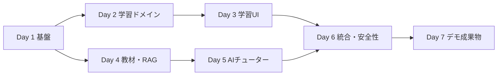

# AI Tutor 7日版 Issue Backlog

## 運用方針

- 対象は`la.linear_combination`の縦切りだけとする。
- Issue IDには`-7D`を付け、旧MVP Issueと区別する。
- 1 Issueは半日以内を目安にし、同じ成果物を変更する作業はまとめる。
- 必須、Stretch、対象外を混在させない。
- 完了はコード作成ではなく、記載した受け入れ条件の確認で判断する。

## 依存関係

## Day 1 — 基盤

| ID | Issue | 主な受け入れ条件 |
|---|---|---|
| `E0-01-7D` | 文書を7日版・Next.js構成へ統一 | 要件、Architecture、README、ToDoが一致 |
| `E0-03-7D` | ローカル起動構成と環境変数を確定 | Next.js、FastAPI、DBの手順と秘密情報境界が明確 |
| `E1-01-7D` | FastAPI基盤とヘルスチェック | レイヤー分離、`GET /health`、APIテスト |
| `E1-02-7D` | Next.js App Router基盤 | 学習ルート、APIクライアント、loading/error |
| `E1-03-7D` | PostgreSQL + pgvector | Compose起動、拡張有効化、FastAPI接続 |
| `E1-04-7D` | SQLAlchemy + Alembic | DBセッション、初期migration、適用確認 |

## Day 2 — 学習ドメイン

| ID | Issue | 主な受け入れ条件 |
|---|---|---|
| `E2-01-7D` | 線形結合KC YAMLを確定 | 必須属性、学習目標、前提KC |
| `E2-02-7D` | KC YAML検証 | 必須項目と存在しない前提KCを検出 |
| `E2-04-7D` | KCモデルを実装 | migrationと永続化テスト |
| `E2-05-7D` | KCを冪等にDB登録 | 再実行で重複しない |
| `E2-06-7D` | KC詳細API | レッスン画面に必要なKCを取得可能 |
| `E4-01a-7D` | Lesson・Question・Hintスキーマ | API入出力と制約が明確 |
| `E4-01b-7D` | Lesson・Question・Hintモデル | migrationと関連が動作 |
| `E4-02-7D` | 線形結合レッスンデータ | 説明、具体例、確認問題 |
| `E4-06-7D` | 2問・3段階ヒント・採点 | 最大ヒントを保存し、正誤理由を返す |
| `E6-01-7D` | Attempt・MasteryStateモデル | 履歴と現在値を保存可能 |
| `E6-02-7D` | Mastery Version 1 | evidence、更新式、単体テスト |
| `E6-03-7D` | 回答フローを統合 | 採点、履歴、Masteryを原子的に更新 |

## Day 3 — 学習UI

| ID | Issue | 主な受け入れ条件 |
|---|---|---|
| `E4-04a-7D` | 一画面の情報設計 | 必須情報と状態の配置が決定 |
| `E4-04b-7D` | レッスン・問題UI | 目標、説明、例、問題、ヒントを表示 |
| `E6-04-7D` | 採点結果・Mastery UI | 正誤、理由、変化、次の行動を表示・再読込で保持 |

## Day 4 — 教材とRAG

| ID | Issue | 主な受け入れ条件 |
|---|---|---|
| `E3-02-7D` | Document・Chunkモデルと非公開保存 | ファイル情報、ページ、KCを追跡可能 |
| `E3-03-7D` | PDF登録API | MIME、サイズ、保存名を安全に扱う |
| `E3-04-7D` | CC0教材を抽出・チャンク化 | 線形結合チャンクに教材名とページを付与 |
| `E3-06-7D` | Embedding生成・保存 | pgvectorとモデル名を保存 |
| `E3-07-7D` | KC付き類似検索 | 出典情報と根拠不足判定を返す |
| `E3-08-7D` | RAG評価ケース3件 | 代表質問と期待出典を固定 |

## Day 5 — AIチューター

| ID | Issue | 主な受け入れ条件 |
|---|---|---|
| `E5-01-7D` | LLMサービスと構造化出力 | FastAPIのみから呼び、Pydanticで検証 |
| `E5-02-7D` | 根拠付き回答と出典 | 教材名・ページ・根拠区分を返す |
| `E5-03-7D` | 根拠不足・LLM障害処理 | 推測せず安全なエラーを返す |
| `E5-04-7D` | AI質問UI | 送信中、失敗、根拠不足、出典、二重送信防止 |

## Day 6 — 統合・安全性

| ID | Issue | 主な受け入れ条件 |
|---|---|---|
| `E9-01a-7D` | 学習フロー統合テスト | 問題、ヒント、採点、履歴、Mastery |
| `E9-01b-7D` | 教材・AIフロー統合テスト | 登録、検索、回答、出典 |
| `E9-02-7D` | RAG品質ケース | 期待出典、根拠不足、補足区分を確認 |
| `E9-03-7D` | 最低限の安全性 | APIキー、PDF、入力、注入、長文転載を確認 |

## Day 7 — デモ成果物

| ID | Issue | 主な受け入れ条件 |
|---|---|---|
| `E9-05-7D` | README・デモ・応募成果物 | 新規起動、テスト、画像、動画、実装状況、ロードマップ |

## Stretch

KC一覧と簡易マップ、PDF.js、AI会話履歴、復習日、復習画面、ブラウザE2E、
性能計測、GitHub Actions、ダークモードは必須Issueの完了後だけ着手する。

## 7日版ではIssue化しないもの

残り9KC、OCR、マルチモーダル解析、高度な検索、Explain-back、Socratic Mode、
Python演習、本格的な復習、認証、複数ユーザー、クラウド公開、負荷試験。
